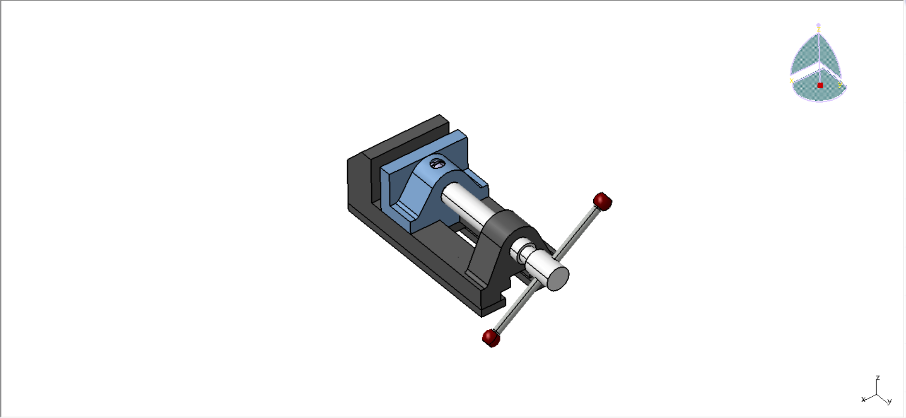

# 🔧 Bench Vice Assembly & Kinematics (Étau de Table) - CATIA V5

Ce projet présente la conception mécanique, l'assemblage et l'analyse cinématique d'un étau de table sous **CATIA V5** dans le cadre de mes études en mécatronique.

---

## 📷 Aperçu du projet

---

## ⚙️ Analyse Cinématique (Kinematics)

Le mécanisme a été modélisé sous le module **DMU Kinematics** de CATIA pour simuler le comportement réel de l'étau :

- **Liaison Hélicoïdale (Screw Joint) :** Transformation du mouvement de rotation de la vis de serrage (`Jaw Screw`) en translation linéaire de la mâchoire mobile (`Vice Jaw`).
- **Liaison Pivot (Revolute Joint) :** Rotation de la barre de manœuvre (`Screw Bar`) à travers la tête de la vis.
- **Liaison Glissière (Prismatic Joint) :** Guidage en translation de la mâchoire mobile sur la base fixe.
- **Degrés de liberté (DOF) :** Simulation du mécanisme complet validée avec 1 degré de liberté principal (commande par le pas de la vis).

---

## 🛠️ Spécifications techniques

- **Logiciel utilisé :** CATIA V5 (Part Design, Assembly Design, DMU Kinematics)
- **Type de projet :** Modélisation 3D, Assemblage & Simulation cinématique
- **Composants intégrés :**
  - Socle / Base (`Base.1`)
  - Mâchoire mobile (`Vice Jaw.1`)
  - Vis de serrage (`Jaw Screw.1`)
  - Plaquettes d'appui & Plaques de fixation (`Base Plate`, `Clamping Plate`)
  - Barre de manœuvre et embouts (`Screw Bar`, `Bar Globes`)
  - Vis d'assemblage (`Set Screws`)

---

## 📂 Organisation du dépôt

- **`/CAD_Native/`** : Fichiers sources CATIA V5 (`.CATProduct`, `.CATPart`).
- **`/CAD_STEP/`** : Modèle 3D universel (`.STEP`) lisible sur tout logiciel CAO.
- **`/Images/`** : Captures d'écran et rendus visuels du projet.
